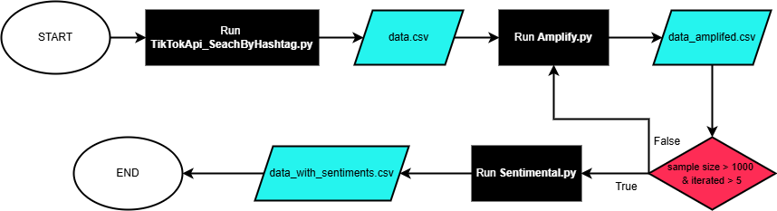
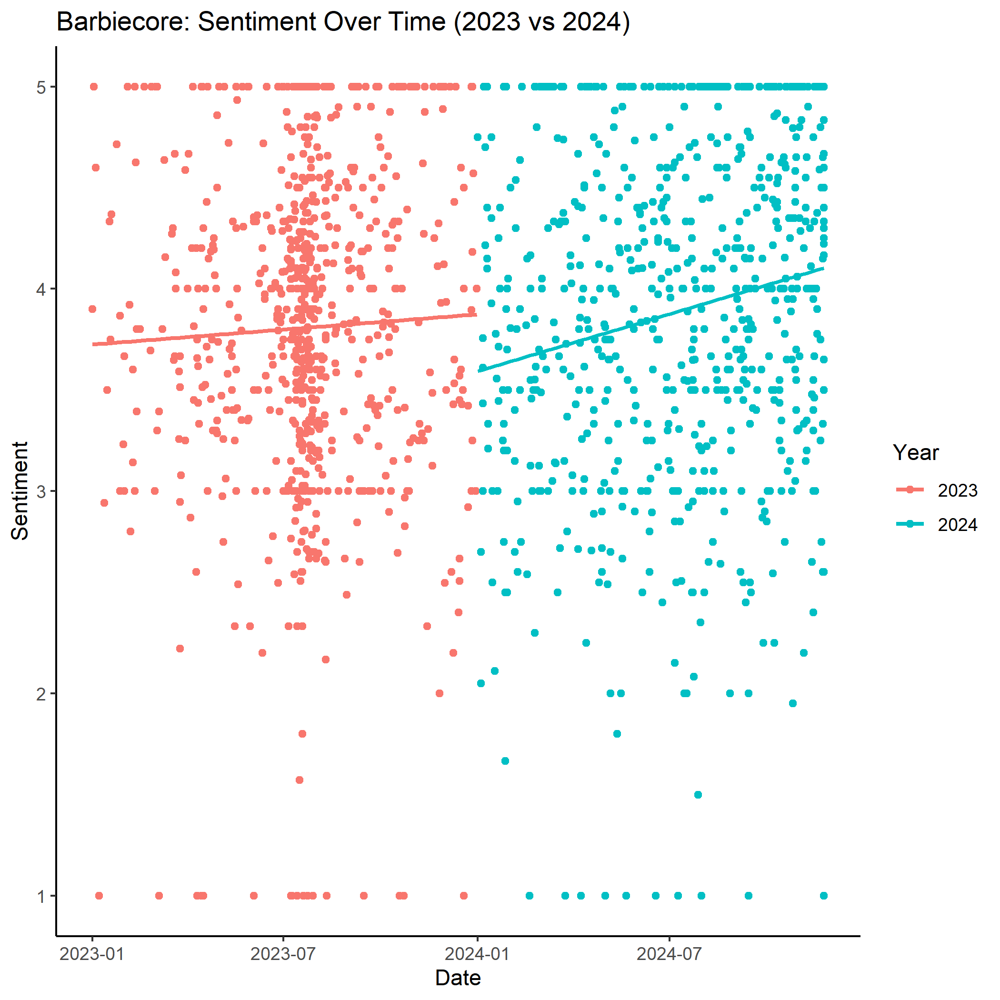
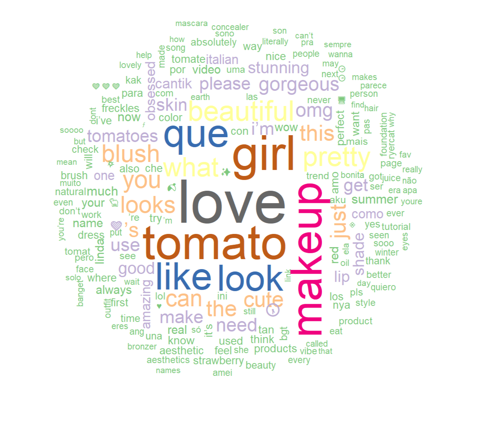
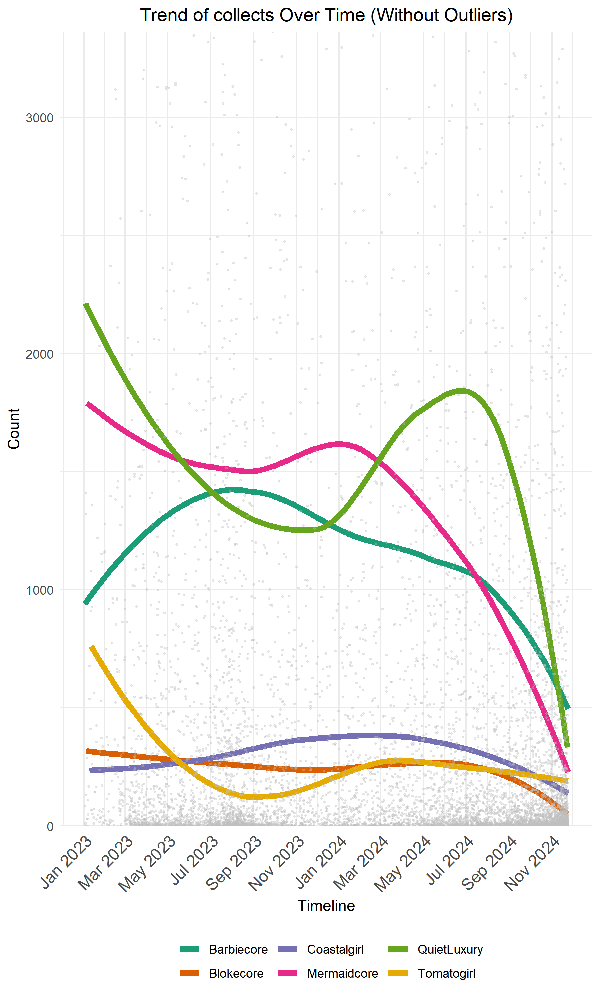
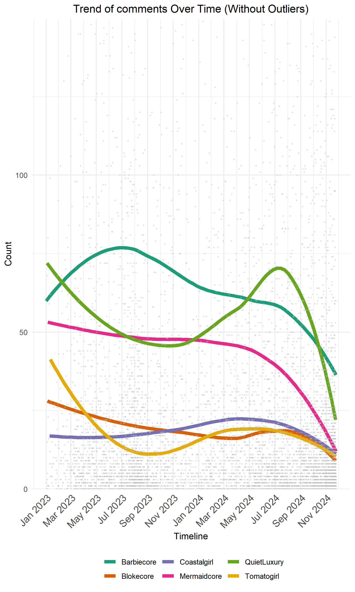
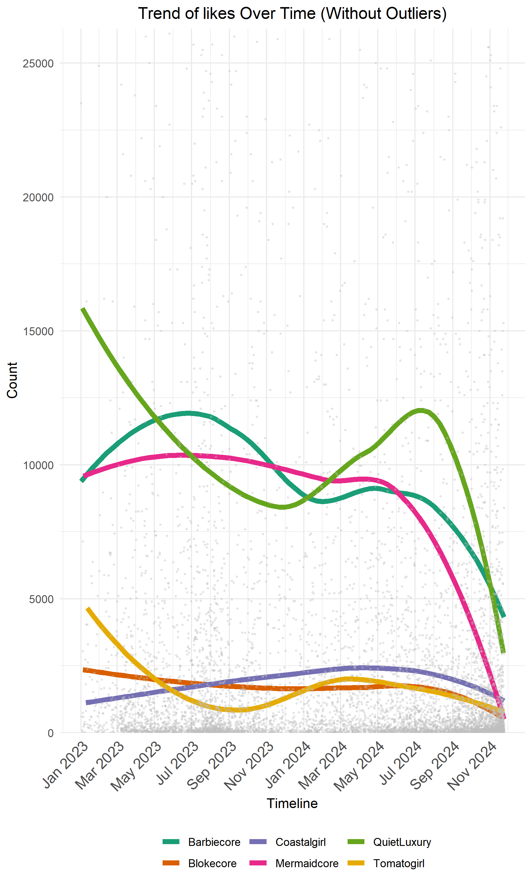
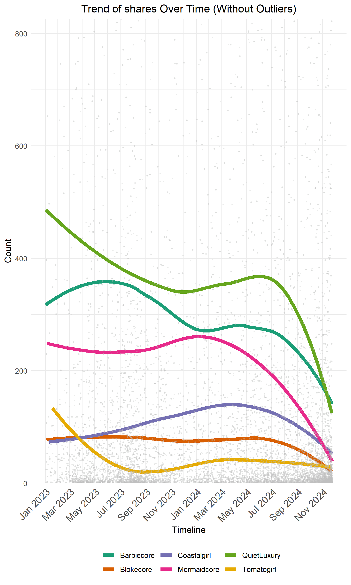
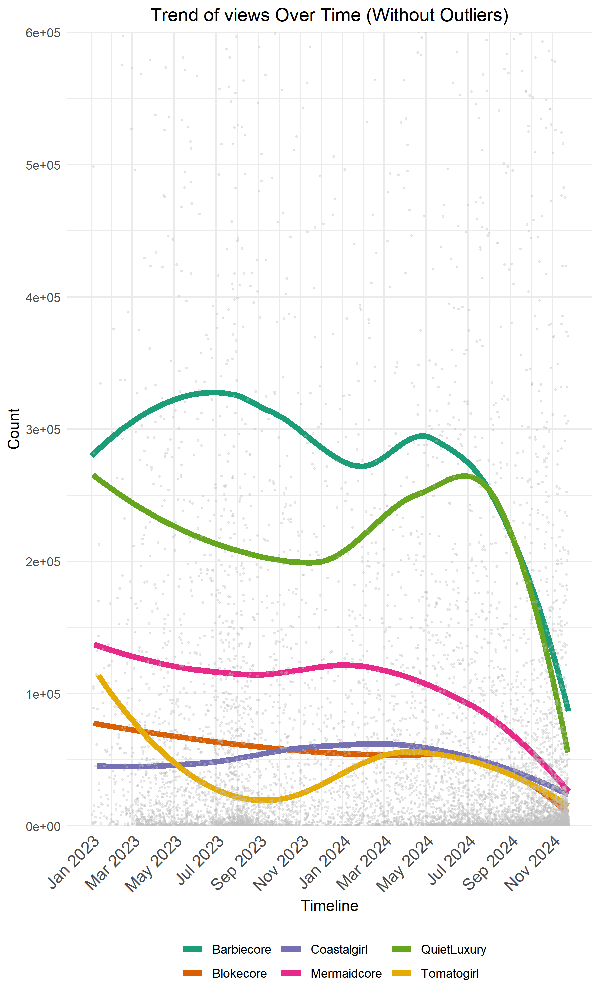
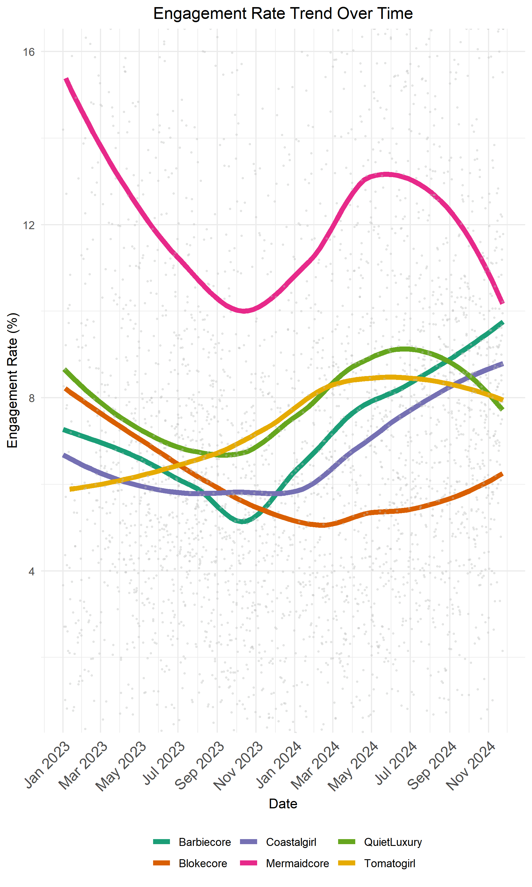
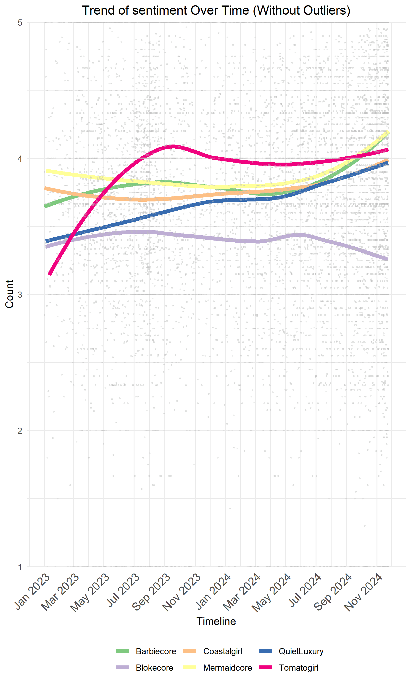

# Tiktok and Fashion

### This project scrapes data from Tiktok and finds its influence in fashion trends.  

This project explores the commercial viability of TikTok driven fashion trends. As one of the most powerful platforms in shaping fashion culture, TikTok regularly launches aesthetics that dominate social feeds. We asked ourselves how many of these trends go beyond virality and influence what we actually wear? Over a 4 month period, the project tracked major fashion trends from 2023~2024 including Quiet Luxury, Barbiecore, Tomato Girl, Mermaidcore, Blokecore, and Coastal Cowgirl.

## Data Scraping

    

The TikTok data collection process involves a multi-step approach to gather a comprehensive dataset of videos related to specific hashtags, such as "mermaidcore" and "tomatogirl". The `TikTokApi_SearchByHashtag.py` script utilizes an unofficial TikTok API wrapper to search for videos by a specific hashtag, retrieving a list of relevant videos that may not necessarily include the exact hashtag due to TikTok's algorithmic collection of related content. However, due to the limitations of the TikTok API, the `Amplify.py` script is employed to enhance the sample size of the video dataset by reading a list of video IDs from a `data.csv` file, sending a request to the API to retrieve related videos, and filtering these results to check if they contain the target hashtag, repeating this process until the dataset reaches a size of over 1000 videos or has been repeated more than 5 times. Finally, the `Sentimental.py` script analyzes the sentiment of sampled comments from the collected videos using a transformer model, providing valuable insights into the emotional tone and public opinion associated with the target hashtags, ultimately allowing for in-depth analysis of trends, sentiment, and engagement metrics related to specific hashtags on TikTok.

## Sentiment anaylisys 

## Trials 
To extract insightful information from the disorganized data contained within the CSV files, a two-stage approach was employed. Initially, a data cleaning process was undertaken, wherein rows with missing values were dropped to ensure data integrity and accuracy. Subsequently, a comprehensive data visualization exercise was conducted, involving the creation of various graphical representations to identify meaningful patterns and trends. These visualisations included distribution analyses, likes by year, a word cloud generated from video comments, sentiment analysis over time, sentiment patterns by day of the week, etc. The graphs below are examples of what visualisations were created in a trials stage. 

    

The graph illustrates the sentiment trend over time, comparing the years 2023 and 2024. While it appears to suggest a rapid growth in sentiment in 2024 relative to 2023, the data is unfortunately too sparse to be considered reliable. The limited number of data points and the significant gaps between them undermine the confidence in the observed trend, making it difficult to draw conclusive insights or make informed decisions based on this visualization alone.

     

The Tomatogirl Wordcloud for 2023 offers a captivating visual representation of text data, enabling a rapid identification of dominant sentiments and ideas surrounding fashion trends. However, its limitations lie in the absence of quantitative data, restricting its ability to provide detailed insights into the impact of TikTok on fashion trends. To gain a deeper understanding. Consequently, the Wordcloud was deemed insufficient for in-depth analysis and was subsequently set aside in favor of visualization techniques that incorporated quantitative methods, enabling a more nuanced and data-driven exploration of the relationship between TikTok and fashion trends.

    
    
    
    
    

To quantify TikTok's impact on fashion trends, I created individual graphs tracking the engagement metrics (collections, comments, likes, shares, and views) of the 6 hashtags. Although each graph exhibits similar trend lines, minor discrepancies arise, likely due to the unique characteristics of each metric, and unknown errors. With multiple graphs to analyze and subtle variations in results, I sought to consolidate the data into a single, comprehensive graph. To achieve this, I considered applying an engagement rate formula, which would enable me to synthesize the disparate metrics into a unified, actionable insight.

## Engagement rate 

    

### Engagement rate formula

$$(likes + comments + shares + saves) / views x 100 %  $$

Engagement rate measures the percentage of people who interacted with the video out of the total number of people who saw it. The total interactions of a TikTok video could be shown as a sum of likes, comments, shares, and saves. 

## Sentiment analysis 

    

## Acknowledgement

* [Unofficial TikTok API in Python](https://github.com/davidteather/TikTok-Api): an unofficial API wrapper for TikTok.com in python. 

## Star History 

